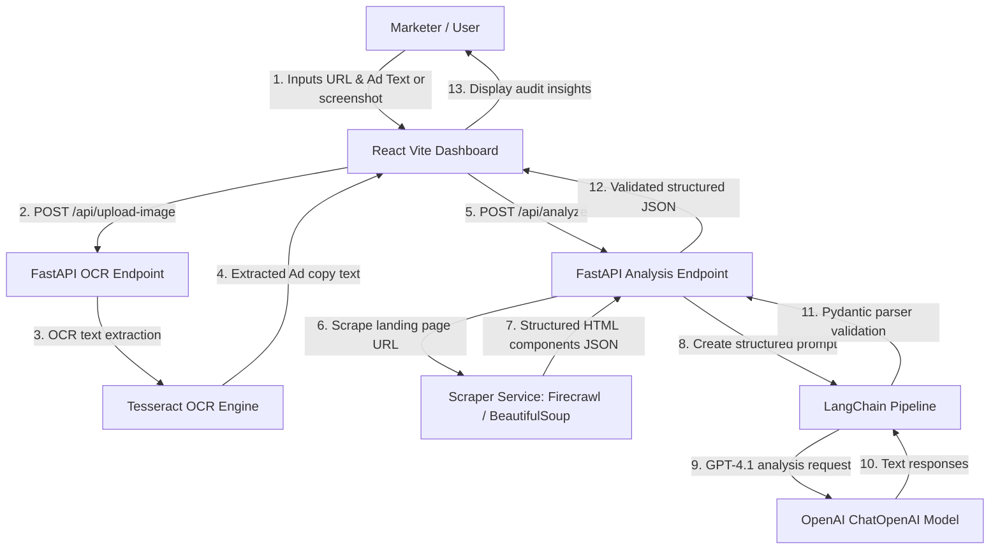

# Ad-to-Landing Page Fit Analyzer (AdMatch.ai)

An AI-powered conversion rate optimization (CRO) web application that audits advertisement creative/copy against its target landing page experience. It identifies narrative friction, offer mismatches, and visual differences to generate a conversion impact audit report with actionable top recommendations.

---

## 🏗️ Architecture Workflow



---

## 🛠️ Tech Stack

### Frontend
- **Framework**: React.js (Vite)
- **Styling**: Tailwind CSS v4 (native Vite plugin, dark mode enabled)
- **State & Animation**: Framer Motion (micro-animations), React Icons
- **HTTP client**: Axios

### Backend
- **Framework**: FastAPI (Python 3.13 compatible)
- **LLM Pipeline**: LangChain + OpenAI GPT-4 (`gpt-4o`)
- **OCR Engine**: Tesseract OCR (with pytesseract wrappers and fallback modes)
- **Scraper**: Firecrawl API (preferred), BeautifulSoup4 (native local fallback)

---

## 📁 Folder Structure

```
ad-landing-analyzer/
├── backend/
│   ├── app/
│   │   ├── langchain/         # LangChain pipelines & parsing
│   │   ├── prompts/           # CRO consultant prompt templates
│   │   ├── routes/            # Health, OCR, and Analysis routes
│   │   ├── schemas/           # Pydantic schema declarations
│   │   ├── services/          # Scraping and OCR operations
│   │   └── main.py            # FastAPI main entry point
│   ├── .env                   # Environment keys configuration
│   └── requirements.txt       # Python dependencies
├── frontend/
│   ├── src/
│   │   ├── components/        # React presentation & charts
│   │   ├── pages/             # Layout and routing pages
│   │   ├── services/          # Axios backend wrappers
│   │   ├── App.jsx            # Main app entry
│   │   └── index.css          # Tailwind CSS global imports
│   ├── vite.config.js         # Vite custom configurations
│   ├── package.json           # Node.js dependencies
│   └── index.html             # SEO header template
└── README.md                  # System overview documentation
```

---

## ⚙️ Installation & Running Locally

### 1. Prerequisites
- **Node.js** (v18 or higher)
- **Python** (3.10 to 3.13)
- **Tesseract OCR Binary** (Optional, recommended for Windows screenshot processing):
  - Download and install Tesseract from [UB Mannheim](https://github.com/UB-Mannheim/tesseract/wiki) and append it to your system PATH, or let the backend auto-detect the installation.

### 2. Backend Setup
1. Open a terminal and navigate to the backend folder:
   ```bash
   cd backend
   ```
2. Create and activate a Python virtual environment:
   ```bash
   python -m venv venv
   # On Windows (Powershell):
   .\venv\Scripts\Activate.ps1
   # On macOS/Linux:
   source venv/bin/activate
   ```
3. Install package dependencies:
   ```bash
   pip install -r requirements.txt
   ```
4. Create a `.env` file inside the `backend` folder:
   ```env
   OPENAI_API_KEY=your-openai-api-key
   FIRECRAWL_API_KEY=your-firecrawl-key-optional
   PORT=8000
   HOST=0.0.0.0
   ```
5. Run the FastAPI development server:
   ```bash
   python app/main.py
   ```
   The backend documentation will be accessible at `http://localhost:8000/docs`.

### 3. Frontend Setup
1. Open a new terminal and navigate to the frontend folder:
   ```bash
   cd frontend
   ```
2. Install npm package dependencies:
   ```bash
   npm install
   ```
3. Run the Vite development server:
   ```bash
   npm run dev
   ```
   The application UI will run at `http://localhost:5173`.

---

## 📡 API Endpoints Documentation

### `POST /api/analyze`
Analyzes matching fit between advertisement copywriting and a target landing page.
- **Request Body**:
  ```json
  {
    "ad_text": "🔥 50% OFF Running Shoes + Free Shipping Today",
    "landing_url": "https://brand.com/shoes"
  }
  ```
- **Response Shape**: Validated Structured JSON (schema maps to `AnalysisResponse` model).

### `POST /api/analyze-multiple`
Clusters advertisement copies into angles (Price, Luxury, Speed, etc.) and analyzes landing page alignment per cluster.
- **Request Body**:
  ```json
  {
    "ad_texts": [
      "🔥 50% OFF Running Shoes + Free Shipping Today",
      "Engineered for marathon runners. Maximum durability and comfort."
    ],
    "landing_url": "https://brand.com/shoes"
  }
  ```

### `POST /api/upload-image`
Processes an uploaded screenshot, runs OCR text extraction, and parses key marketing items.
- **Request Body**: Form Data with `file` key (image format)
- **Response Shape**:
  ```json
  {
    "extracted_text": "Complete image text...",
    "headline": "Ad Headline",
    "subheadline": "Ad Subheading",
    "offer": "Special Offer details",
    "cta": "Call to Action",
    "brand": "Brand Name",
    "discount": "Discount details"
  }
  ```

### `GET /api/health`
Returns backend API execution status and reports configured keys/binaries status.

---

## 🚀 Deployment Instructions

### Frontend (Vercel)
1. Install Vercel CLI or connect repository to Vercel dashboard.
2. Set build command to `npm run build` and output directory to `dist`.
3. Set environment variable: `VITE_API_URL` pointing to your deployed backend URL (e.g. `https://your-backend.render.com/api`).

### Backend (Render)
1. Create a new Web Service on Render.
2. Select **Python** as environment.
3. Set Build Command: `pip install -r requirements.txt`.
4. Set Start Command: `python -m uvicorn app.main:app --host 0.0.0.0 --port $PORT`.
5. Define environment variables in Render: `OPENAI_API_KEY`, `FIRECRAWL_API_KEY`.
